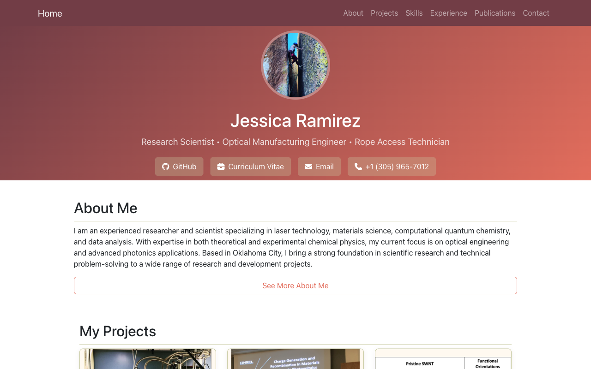

# Jessica Ramirez | Personal Website



This repository contains the source code for my personal website, hosted at [jramz87.github.io](https://jramz87.github.io/).

## About This Site
This is my personal portfolio website where I showcase my background, skills, and projects related to both my professional career and my personal interests.

## Technology Stack
[](https://reactjs.org/)
[](https://nodejs.org/)
[](https://developer.mozilla.org/en-US/docs/Web/HTML)
[](https://developer.mozilla.org/en-US/docs/Web/CSS)
[](https://getbootstrap.com/)
[](https://pages.github.com/)
[](https://developer.mozilla.org/en-US/docs/Web/JavaScript)

## Site Structure
- **Home**: Overview
- **About**: My story
- **Projects**: Showcase of technical and non-technical interests
- **Skills**: Highlights my various skills are certifications
- **Experience**: Timeline of my work history
- **Publications**: Peer-reviewed publications I've authored or co-authored
- **Contact**: Interface to message me directly

## Development
This project was bootstrapped with [Create React App](https://github.com/facebook/create-react-app).

### Local Development
To run this site locally:
```bash
# Clone the repository
git clone https://github.com/jramz87/jramz87.github.io.git
# Navigate to the project directory
cd jramz87.github.io
# Install dependencies
npm install --force
# Start the development server
npm start
```
The site will be available at [http://localhost:3000](http://localhost:3000) in your browser.

### Available Scripts
- `npm start` - Runs the app in development mode
- `npm test` - Launches the test runner
- `npm run build` - Builds the app for production
- `npm run deploy` - Deploys the app to GitHub Pages
- `npm run screenshot` - Takes a screenshot of the homepage

### Deployment
This site is automatically deployed to GitHub Pages when changes are pushed to the main branch. To manually deploy:
```bash
npm run build
npm run deploy
```

## Future Enhancements
- Resolve dependency issue requiring `--force` flag when running `npm install`
- Finish building out Skills page
- Create a project showcase with specific projects from my portfolio

## Connect
Feel free to reach out if you have questions or would like to collaborate!    
[](mailto:jramz1897@gmail.com)
[](https://jramz87.github.io/)

## License
This project is licensed under [](/LICENSE)  - see the LICENSE file for details.
